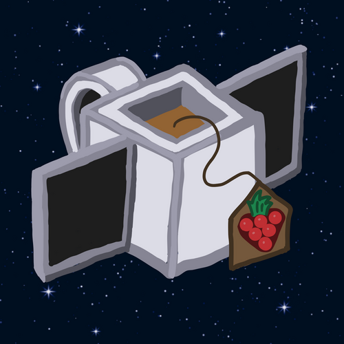
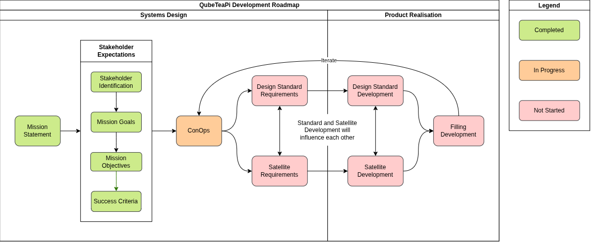

# QubeTeaPi - An open-source, low-cost picosat bus and design standard

## Mission Summary
QubeTeaPi is an open-source, PocketQube-format satellite bus and design standard that serves to provide a low-cost platform for makers, educators, students, and businesses to launch a payload into orbit. 
Read the full mission statement [here](docs/systems_design/mission_statement.md).

**NOTE**: the satellite bus is referred to as the "pastry", and payloads are referred to as "fillings". Find other terminology/acronym definitions [here](docs/definitions_and_acronyms.md).
## Key Features
- Open-source design
- RP2040 OBC
- Ultra-low-cost BOM objective (<£100)
- PocketQube-format (1-3P)
- Designed for LEO/SSO
- Modular pastry and fillings ecosystem
## Development Roadmap

I am currently working on the initial systems engineering documentation for both the design standard and first pastry (the development of these will influence each other).
## Baking Your QubeTeaPi
Read the mission ConOps [here](docs/systems_design/con_ops/mission_con_ops.md).
You can bake existing recipes for pastries and fillings, or create your own!
In order to launch a satellite, you must purchase a slot with a launch broker. Although PocketQubes are cheap to launch compared to other satellites, the cost of launching your QubeTeaPi will greatly exceed the cost of manufacturing it. For example, the cost of launching a 1P PocketQube through Alba Orbital is €25000.
## Using the Design Standard
Read the standard ConOps [here](docs/systems_design/con_ops/standard_con_ops.md).
The standard provides guidance and regulations for the development of new pastries and fillings.
## Licensing
This project is licensed under CERN-OHL-W v2.
