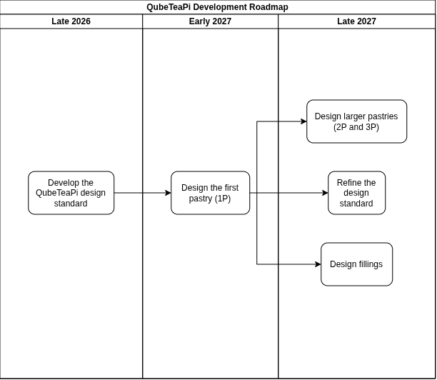

# Stakeholder Identification
The following actors have been identified as stakeholders:
- People who wish to use existing pastries and fillings for their missions, referred to as **customers**
- People who wish to develop their own fillings for specific missions, referred to as **developers**
- People who wish to expand the QubeTeaPi project by developing new pastries, referred to as **contributors** 
# Mission Goals

